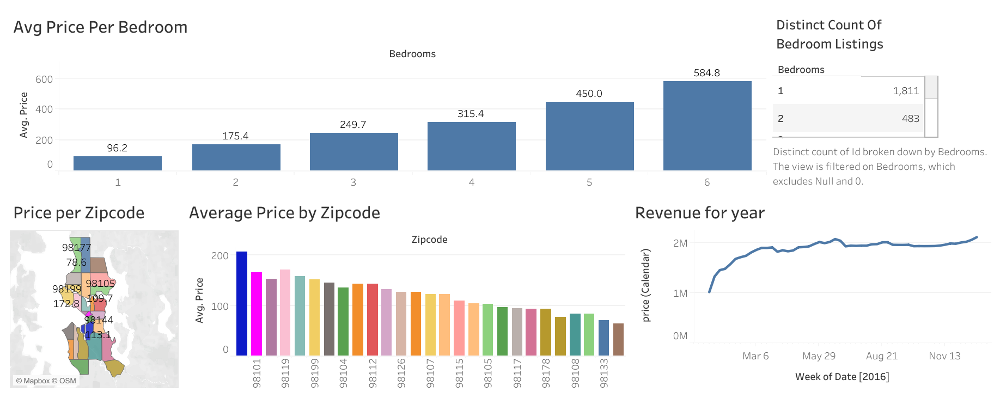

# 🏡 Airbnb Data Visualization in Tableau

[](https://public.tableau.com/app/profile/pooja.pandit)

This repository showcases an interactive Tableau dashboard built using the Airbnb 2016 Listings dataset. The dashboard provides actionable insights into pricing trends, revenue distribution, and geographical patterns, helping hosts and analysts better understand the Airbnb marketplace.  

🌐 **[📊 View the Published Dashboard on Tableau Public](https://public.tableau.com/app/profile/pooja.pandit/viz/AirBnBDatasetTableauVisualization/Dashboard1?publish=yes)**  

---

## 🖼 Dashboard Preview



---

## 📊 Project Overview

This Tableau dashboard explores key aspects of the Airbnb dataset:  

- 💸 **Average Price per Bedroom**: Shows pricing trends for different room sizes.  
- 🌎 **Price per Zipcode (Map)**: Highlights pricing patterns across different neighborhoods.  
- 📈 **Revenue Trends**: Tracks revenue growth over the year 2016.  
- 🛏️ **Bedroom Listing Distribution**: Visualizes the distribution of property sizes.  

---

## 📂 Repository Contents

| File                                               | Description                                                  |
|-----------------------------------------------------|--------------------------------------------------------------|
| `AirBnB Dataset Tableau Visualization.twbx`        | Tableau packaged workbook containing the dashboard.          |
| `airbnb_dashboard.png`                              | Screenshot of the Airbnb Tableau dashboard.                  |
| `README.md`                                         | Project documentation and overview.                          |

---

## 🌐 Data Sources & Links

- **Kaggle Dataset**: [Airbnb Listings 2016 Dataset](https://www.kaggle.com/datasets/alexanderfreberg/airbnb-listings-2016-dataset)  
- **Tableau Public Dashboard**: [View Dashboard](https://public.tableau.com/app/profile/pooja.pandit/viz/AirBnBDatasetTableauVisualization/Dashboard1?publish=yes)  

---

## 🏆 Skills Demonstrated
✅ Data cleaning and transformation in Excel  
✅ Tableau dashboard design and storytelling  
✅ Geographic mapping and visual analytics  
✅ Publishing dashboards to Tableau Public  

---

## 📥 Getting Started
1. Clone the repository:
   ```bash
   git clone https://github.com/panditpooja/tableau-airbnb-data-visualization.git
   ```
2. Open `AirBnB Dataset Tableau Visualization.twbx` in Tableau Desktop.  
3. Explore the dashboard or view it live on [Tableau Public](https://public.tableau.com/app/profile/pooja.pandit/viz/AirBnBDatasetTableauVisualization/Dashboard1?publish=yes).  

---

## ✍️ Author

**Pooja Pandit**  
Master’s Student in Information Science (Machine Learning)  
The University of Arizona  

[](https://github.com/panditpooja)
[](https://www.linkedin.com/in/pooja-pandit-177978135/)
